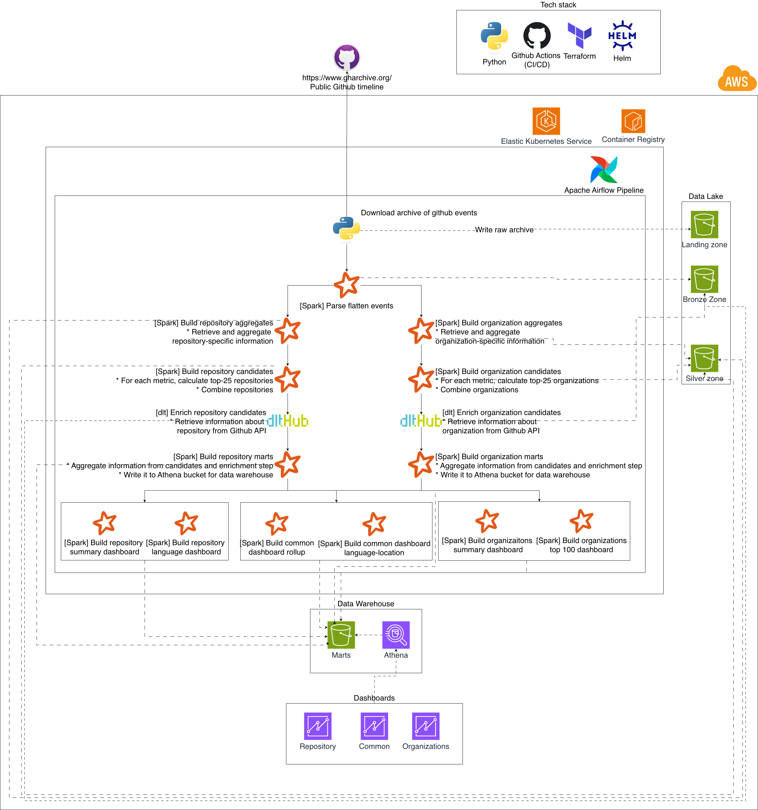
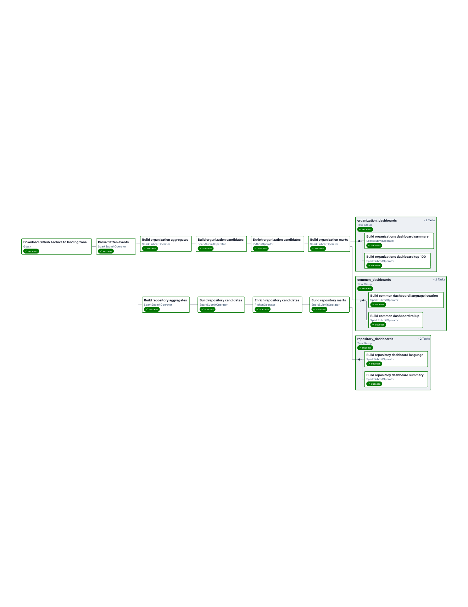

# GitHub Batch Analytics

## 🎯 Objective

Build a production-oriented batch analytics platform for GitHub public activity that can:

- ingest hourly GH Archive event files reliably
- convert raw, nested event payloads into structured analytical datasets
- identify repositories and organizations worth deeper analysis
- enrich those candidates with GitHub API metadata
- publish curated marts and dashboard-ready datasets to a low-ops warehouse
- expose those datasets to downstream BI consumers through Athena and Amazon QuickSight

The project is intentionally designed as a lakehouse-style batch pipeline rather than a streaming system. The emphasis is on predictable hourly processing, cheap object storage, reproducible Spark jobs, and queryable Parquet outputs that can power analyst workflows and QuickSight dashboards without maintaining a dedicated warehouse cluster.

## 🧩 Problem Statement

GH Archive publishes GitHub activity as hourly JSON event files. That raw feed is valuable, but it is not directly usable for analytics or reporting:

- the source format is event-level and heavily nested
- repository and organization metrics must be derived from multiple event families
- entity-level business dimensions such as language, owner type, location, company, or verification status are not available directly in the event feed
- downstream users need stable analytical tables and dashboard datasets, not raw JSON blobs

This project solves that by orchestrating an hourly Airflow DAG that runs Spark jobs over GH Archive data, stores each transformation stage in S3, enriches selected entities through the GitHub API, and publishes Glue Catalog tables that can be queried in Athena and visualized in QuickSight.

## 🔄 Data Pipeline

The main DAG is [`github_analysis.py`](./dags/github_analysis.py). It runs every hour at `HH:05`.

This is a batching flow:

- every run processes one hourly slice of GitHub activity
- each task reads from immutable hourly S3 paths and writes to a new hourly partition
- the pipeline trades freshness for operational simplicity and reproducibility
- downstream warehouse tables are therefore organized by `dt` and `hr` and naturally align with the batch schedule

Pipeline stages:

1. `get_github_events_archive`
   - downloads the hourly GH Archive file from `https://data.gharchive.org/{{ ds }}-{{ logical_date.hour }}.json.gz`
   - stores the raw file in the landing zone
2. `parse_flatten_events`
   - reads the compressed archive
   - flattens nested JSON into structured Parquet rows in the bronze zone
3. `build_repo_aggregates` and `build_org_aggregates`
   - computes hourly repository- and organization-level activity metrics
   - writes the outputs into the silver zone
4. `build_repo_candidates` and `build_org_candidates`
   - ranks and filters entities that should be enriched further
   - writes candidate datasets to the silver zone
5. `enrich_repo_candidates` and `enrich_org_candidates`
   - calls the GitHub API for repository and organization metadata snapshots
   - stores enrichment outputs in S3
6. `build_repo_marts` and `build_org_marts`
   - joins event-derived metrics with enriched metadata
   - writes curated Parquet marts to the marts bucket
7. dashboard builders
   - materialize dashboard-specific datasets for repositories, organizations, and common cross-cutting views
   - these outputs are exposed through Athena tables and intended for QuickSight consumption

S3 zones:

- landing: raw GH Archive downloads
- bronze: flattened events and enrichment snapshots
- silver: aggregates and candidate datasets
- marts: curated marts and dashboard outputs

## 🗺️ Diagram

### Services Diagram



### Airflow DAG



## 🧱 Structure

```text
.
├── .dlt/                                                  - Local DLT configuration directory.
│   └── config.toml                                        - Base DLT runtime configuration.
├── .github/                                               - GitHub automation configuration.
│   └── workflows/                                         - CI validation workflows.
│       ├── dag.yml                                        - CI for DAG and Python test changes under `dags/` and `tests/`.
│       ├── helm.yml                                       - CI for Helm chart linting and template rendering.
│       └── terraform.yml                                  - CI for Terraform fmt, tests, and plan.
├── .env.sample                                            - Example local environment variables for Airflow and bucket names.
├── .envrc.sample                                          - Example `direnv` file for AWS, Terraform, and Python path setup.
├── .gitignore                                             - Git ignore rules for local state, credentials, and generated artifacts.
├── .python-version                                        - Python version pin for local tooling.
├── .sqlfluff                                              - SQLFluff configuration for dashboard SQL files.
├── Dockerfile                                             - Airflow runtime image with Spark client binaries copied from the Spark image.
├── Dockerfile.jupyter                                     - Local Jupyter/Spark notebook image.
├── Makefile                                               - Common local linting, notebook, and utility commands.
├── README.md                                              - Project overview, architecture, and local setup.
├── dags/                                                  - Airflow DAG definitions and pipeline implementation.
│   ├── __init__.py                                        - Marks `dags` as a Python package.
│   ├── github_analysis.py                                 - Main hourly batch DAG orchestrating the entire pipeline.
│   └── gba/                                               - Application package for services, tasks, and settings.
│       ├── __init__.py                                    - Marks the package root.
│       ├── services/                                      - Spark jobs and service-layer business logic.
│       │   ├── __init__.py                                - Marks services as a package.
│       │   ├── build_aggregates.py                        - Computes repository and organization aggregates.
│       │   ├── build_candidates.py                        - Scores and filters candidate entities for enrichment.
│       │   ├── build_curated_marts.py                     - Builds final curated repository and organization marts.
│       │   ├── build_dashboard_views.py                   - Executes SQL-backed dashboard dataset builders.
│       │   ├── download_github_archive.py                 - Downloads and uploads hourly GH Archive files.
│       │   ├── parse_flatten.py                           - Flattens raw event JSON into structured Parquet.
│       │   ├── utils.py                                   - Shared helpers such as `s3://` to `s3a://` conversion.
│       │   ├── dashboards/                                - SQL definitions for dashboard datasets.
│       │   │   ├── common/                                - Cross-domain dashboards combining repository and organization marts.
│       │   │   │   ├── language_location.sql              - Common dashboard by repository language and org location.
│       │   │   │   ├── rollup.sql                         - Common rollup dashboard across marts.
│       │   │   │   └── verified.sql                       - Common dashboard around verification dimensions.
│       │   │   ├── organizations/                         - Organization dashboard SQL definitions.
│       │   │   │   ├── company.sql                        - Organization dashboard grouped by company.
│       │   │   │   ├── location.sql                       - Organization dashboard grouped by location.
│       │   │   │   ├── size.sql                           - Organization size distribution dashboard.
│       │   │   │   ├── social.sql                         - Organization social/profile metrics dashboard.
│       │   │   │   ├── summary.sql                        - Main organization summary dashboard.
│       │   │   │   ├── top_100.sql                        - Top organizations dashboard.
│       │   │   │   └── verified_distribution.sql          - Verification-status distribution dashboard.
│       │   │   └── repositories/                          - Repository dashboard SQL definitions.
│       │   │       ├── event_type.sql                     - Event-type distribution dashboard.
│       │   │       ├── fork.sql                           - Fork-status dashboard.
│       │   │       ├── freshness.sql                      - Repository freshness dashboard.
│       │   │       ├── language.sql                       - Repository language dashboard.
│       │   │       ├── owner.sql                          - Repository owner-type dashboard.
│       │   │       ├── summary.sql                        - Main repository summary dashboard.
│       │   │       ├── top_100.sql                        - Top repositories dashboard.
│       │   │       └── visibility.sql                     - Repository visibility dashboard.
│       │   └── enrichment/                                - GitHub API enrichment clients and logic.
│       │       ├── __init__.py                            - Marks enrichment as a package.
│       │       ├── client.py                              - Low-level GitHub API client logic.
│       │       ├── errors.py                              - Enrichment-specific exception types.
│       │       ├── organization.py                        - Organization enrichment workflow and S3 outputs.
│       │       └── repository.py                          - Repository enrichment workflow and S3 outputs.
│       ├── settings/                                      - Typed configuration loaders for tasks and services.
│       │   ├── __init__.py                                - Marks settings as a package.
│       │   ├── build_aggregates.py                        - Settings for aggregate-building tasks.
│       │   ├── build_candidates.py                        - Settings for candidate-building tasks.
│       │   ├── build_curated_marts.py                     - Settings for marts generation.
│       │   ├── build_dashboard_views.py                   - Settings for dashboard generation.
│       │   ├── enrich_candidates.py                       - Settings for GitHub enrichment tasks.
│       │   ├── enums.py                                   - Shared enums for dashboard and pipeline settings.
│       │   ├── get_archive.py                             - Settings for GH Archive downloads.
│       │   └── parse_flatten.py                           - Settings for flattening raw events.
│       └── tasks/                                         - Airflow task factories wrapping services as operators.
│           ├── __init__.py                                - Marks tasks as a package.
│           ├── build_aggregates.py                        - Creates SparkSubmitOperator tasks for aggregates.
│           ├── build_candidates.py                        - Creates SparkSubmitOperator tasks for candidates.
│           ├── build_dashboard_views.py                   - Creates SparkSubmitOperator tasks for dashboards.
│           ├── build_marts.py                             - Creates SparkSubmitOperator tasks for curated marts.
│           ├── enrich_candidates.py                       - Creates enrichment tasks for GitHub API snapshots.
│           ├── get_archive.py                             - Creates the archive download task.
│           ├── parse_flatten_events.py                    - Creates the flattening Spark task.
│           └── spark_conf.py                              - Shared Spark configuration assembly.
├── docker-compose.yaml                                    - Local development stack for Airflow, Spark, Postgres, and Jupyter.
├── infra/                                                 - Deployment and infrastructure definitions.
│   ├── helm/                                              - Helm chart for Kubernetes deployment.
│   │   └── github-batch-analytics/                        - Application chart.
│   │       ├── Chart.yaml                                 - Chart metadata.
│   │       ├── values.yaml                                - Default chart values for images, buckets, and resources.
│   │       └── templates/                                 - Kubernetes manifests rendered by Helm.
│   │           ├── NOTES.txt                              - Post-install notes shown by Helm.
│   │           ├── _helpers.tpl                           - Shared Helm template helpers.
│   │           ├── airflow-api-server.yaml                - Airflow API server deployment and service.
│   │           ├── airflow-dag-processor.yaml             - Airflow DAG processor deployment.
│   │           ├── airflow-init-job.yaml                  - One-shot Airflow database initialization job.
│   │           ├── airflow-scheduler.yaml                 - Airflow scheduler deployment.
│   │           ├── configmap.yaml                         - Non-secret runtime environment configuration.
│   │           ├── secret.yaml                            - Secret-backed runtime configuration.
│   │           ├── serviceaccount.yaml                    - Kubernetes service account with IAM role integration.
│   │           ├── spark-master.yaml                      - Spark master deployment and service.
│   │           └── spark-worker.yaml                      - Spark worker deployment.
│   ├── scripts/                                           - Helper scripts for image and infrastructure deployment.
│   │   ├── build_and_push_image.sh                        - Builds and pushes the Airflow application image.
│   │   ├── deploy_app.sh                                  - Deploys the application stack to Kubernetes with Helm.
│   │   └── deploy_infra.sh                                - Applies infrastructure changes with Terraform.
│   └── terraform/                                         - Terraform root module and reusable infrastructure modules.
│       ├── README.md                                      - Terraform-specific notes, including remote state bootstrap.
│       ├── backend.hcl.example                            - Example backend configuration for remote S3 state.
│       ├── backend.tf                                     - Backend block declaration.
│       ├── github_provider.tf                             - GitHub provider configuration.
│       ├── main.tf                                        - Root module wiring across infrastructure modules.
│       ├── outputs.tf                                     - Root outputs for shared infrastructure values.
│       ├── provider.tf                                    - AWS provider configuration.
│       ├── terraform.tfvars.example                       - Example Terraform variables file.
│       ├── variables.tf                                   - Root input variables.
│       ├── versions.tf                                    - Terraform and provider version constraints.
│       ├── modules/                                       - Reusable infrastructure modules.
│       │   ├── catalog/                                   - Athena and Glue warehouse metadata.
│       │   │   ├── main.tf                                - Creates Athena workgroup, Glue database, and Glue tables.
│       │   │   ├── outputs.tf                             - Exposes catalog resource identifiers.
│       │   │   └── variables.tf                           - Inputs for the catalog module.
│       │   ├── database/                                  - PostgreSQL infrastructure.
│       │   │   ├── main.tf                                - Creates the Airflow RDS database and networking resources.
│       │   │   ├── outputs.tf                             - Exposes database connection values.
│       │   │   └── variables.tf                           - Inputs for the database module.
│       │   ├── eks_cluster/                               - Kubernetes cluster infrastructure.
│       │   │   ├── main.tf                                - Creates the EKS cluster and managed node group.
│       │   │   ├── outputs.tf                             - Exposes cluster identifiers and access details.
│       │   │   └── variables.tf                           - Inputs for the EKS module.
│       │   ├── github_repo/                               - GitHub repository variables and secrets.
│       │   │   ├── main.tf                                - Creates GitHub Actions variables and secrets.
│       │   │   ├── variables.tf                           - Inputs for the GitHub repository module.
│       │   │   └── versions.tf                            - Provider version constraints for the GitHub module.
│       │   ├── identity/                                  - IAM roles, policies, OIDC, and access control.
│       │   │   ├── main.tf                                - Creates IAM resources for runtime and CI/CD access.
│       │   │   ├── outputs.tf                             - Exposes IAM role and policy outputs.
│       │   │   └── variables.tf                           - Inputs for the identity module.
│       │   ├── network/                                   - VPC and subnet topology.
│       │   │   ├── main.tf                                - Creates the VPC, subnets, routes, and NAT gateway.
│       │   │   ├── outputs.tf                             - Exposes networking identifiers.
│       │   │   └── variables.tf                           - Inputs for the network module.
│       │   ├── registry/                                  - Container registry resources.
│       │   │   ├── main.tf                                - Creates the ECR repository and lifecycle policy.
│       │   │   ├── outputs.tf                             - Exposes registry identifiers and URLs.
│       │   │   └── variables.tf                           - Inputs for the registry module.
│       │   └── storage/                                   - S3 buckets and related access policies.
│       │       ├── main.tf                                - Creates landing, bronze, silver, marts, DLT state, and logging buckets.
│       │       ├── outputs.tf                             - Exposes bucket names, ARNs, and policy outputs.
│       │       └── variables.tf                           - Inputs for the storage module.
│       └── tests/                                         - Native Terraform tests executed with `terraform test`.
│           ├── catalog.tftest.hcl                         - Tests the catalog module.
│           ├── database.tftest.hcl                        - Tests the database module.
│           ├── github_repo.tftest.hcl                     - Tests the GitHub repository module.
│           ├── identity.tftest.hcl                        - Tests the identity module.
│           ├── registry.tftest.hcl                        - Tests the registry module.
│           └── storage.tftest.hcl                         - Tests the storage module.
├── notebooks/                                             - Exploratory notebooks and Spark helpers.
│   ├── 3_build_aggregates_org.ipynb                       - Notebook for organization aggregate exploration.
│   ├── 3_build_aggregates_repo.ipynb                      - Notebook for repository aggregate exploration.
│   ├── 4_build_candidates.ipynb                           - Notebook for candidate-building experiments.
│   ├── 6_write_warehouse.ipynb                            - Notebook for warehouse and Athena-related checks.
│   ├── README.md                                          - Notes for notebook usage.
│   ├── __init__.py                                        - Marks notebooks helpers as a package.
│   └── spark_session.py                                   - Shared Spark session helper for notebooks.
├── pyproject.toml                                         - Python project metadata and dependencies.
├── tests/                                                 - Unit and integration test suite.
│   ├── __init__.py                                        - Marks tests as a package.
│   ├── conftest.py                                        - Shared pytest fixtures and test configuration.
│   ├── integration/                                       - End-to-end and task-level integration tests.
│   │   ├── test_build_aggregates_task_integration.py      - Integration tests for aggregate tasks.
│   │   ├── test_build_candidates_task_integration.py      - Integration tests for candidate tasks.
│   │   ├── test_build_marts_task_integration.py           - Integration tests for mart-building tasks.
│   │   ├── test_download_github_archive_integration.py    - Integration tests for GH Archive download service.
│   │   ├── test_get_archive_task_integration.py           - Integration tests for archive Airflow task wiring.
│   │   ├── test_github_analysis_dag_integration.py        - Integration tests for DAG structure and dependencies.
│   │   ├── test_parse_flatten_events_task_integration.py  - Integration tests for flatten task execution.
│   │   └── test_parse_flatten_service_integration.py      - Integration tests for flattening service behavior.
│   └── unit/                                              - Fast unit tests for services and tasks.
│       ├── test_build_aggregates_service.py               - Unit tests for aggregate-building logic.
│       ├── test_build_candidates_service.py               - Unit tests for candidate scoring and filtering.
│       ├── test_build_curated_marts_service.py            - Unit tests for curated marts logic.
│       ├── test_build_dashboard_views_service.py          - Unit tests for dashboard view generation.
│       ├── test_download_github_archive.py                - Unit tests for archive download behavior.
│       ├── test_get_archive_task.py                       - Unit tests for the archive Airflow task factory.
│       ├── test_organization_enrichment_service.py        - Unit tests for organization enrichment.
│       ├── test_parse_flatten_events_task.py              - Unit tests for the flatten Airflow task factory.
│       ├── test_parse_flatten_service.py                  - Unit tests for event flattening.
│       └── test_repository_enrichment_service.py          - Unit tests for repository enrichment.
└── uv.lock                                                - Locked Python dependency graph for `uv`.
```

## 🏛️ Data Warehouse

Athena is the warehouse query layer for this project because it matches the storage and processing model:

- the pipeline already writes Parquet datasets to S3
- Glue Catalog provides the metadata layer without extra warehouse infrastructure
- analysts can query the same S3-backed datasets that power the batch pipeline
- QuickSight can sit on top of Athena to build dashboards without introducing another serving database
- the operational model stays simple: Spark writes Parquet, Glue defines metadata, Athena queries it, QuickSight visualizes it

Warehouse metadata is defined in [`infra/terraform/modules/catalog/main.tf`](./infra/terraform/modules/catalog/main.tf).

Current warehouse design:

- Glue database: `github_analytics`
- Athena workgroup: `github-batch-analytics`
- core mart tables:
  - `repositories`
  - `organizations`
- dashboard tables:
  - repository dashboards under `dashboards/repositories/...`
  - organization dashboards under `dashboards/organizations/...`
  - common dashboards under `dashboards/common/...`
- BI consumption path:
  - Spark writes Parquet to S3
  - Glue Catalog exposes the datasets to Athena
  - Athena provides the SQL layer
  - QuickSight can use Athena datasets as the dashboard source

Partitioning strategy:

- every analytical table is partitioned by:
  - `dt` as the batch date
  - `hr` as the batch hour
- physical S3 layout follows the same contract, for example:
  - `s3://<marts-bucket>/repositories/dt=YYYY-MM-DD/hr=H/`
  - `s3://<marts-bucket>/organizations/dt=YYYY-MM-DD/hr=H/`
  - `s3://<marts-bucket>/dashboards/.../dt=YYYY-MM-DD/hr=H/`
- partition projection is enabled in Glue table parameters, so Athena can resolve partitions without running `MSCK REPAIR TABLE` or adding partitions after every batch

Clustering and file layout:

- Parquet is used as the storage format for marts and dashboard datasets
- there is no explicit Athena bucketing or clustering configured in the Glue tables
- performance comes primarily from:
  - partition pruning on `dt` and `hr`
  - Parquet column pruning
  - smaller dashboard-specific datasets written for downstream reporting

This is a deliberate tradeoff. For hourly batch analytics, partitioned Parquet on S3 plus Athena is simpler and cheaper than operating a dedicated warehouse, and it is a natural fit for QuickSight dashboards built over time-partitioned analytical tables.

## 🛠️ Local Setup

### Prerequisites

- Python `3.12`
- [`uv`](https://docs.astral.sh/uv/)
- Docker and Docker Compose
- AWS credentials with access to the project buckets
- `direnv` if you want repository-local environment loading via `.envrc`

### 1. Prepare configuration

Create local environment files if they do not exist:

```bash
cp .env.sample .env
cp .envrc.sample .envrc
```

Populate the local secrets and credentials:

- put AWS config and credentials under `.local/aws/`
- populate `.dlt/secrets.toml`
- set `TF_VAR_github_token` in `.envrc` if you work with Terraform and GitHub resources locally

If you use `direnv`, load the environment:

```bash
direnv allow
```

### 2. Install Python dependencies

```bash
uv sync --dev
```

### 3. Start the local stack

```bash
docker compose up --build
```

This starts:

- Postgres for Airflow metadata
- Airflow init, API server, scheduler, and DAG processor
- Spark master and worker
- Jupyter notebook container

Useful endpoints:

- Airflow UI: `http://localhost:8080`
- Spark master UI: `http://localhost:8081`
- JupyterLab: `http://localhost:8888`

### 4. Run tests

```bash
uv run pytest -q
```

### 5. Run Terraform checks

```bash
terraform -chdir=infra/terraform fmt -check -recursive
terraform -chdir=infra/terraform test
terraform -chdir=infra/terraform plan
```

### 6. Useful development commands

```bash
make ty
make black
make ruff
make sqlfluff
```
